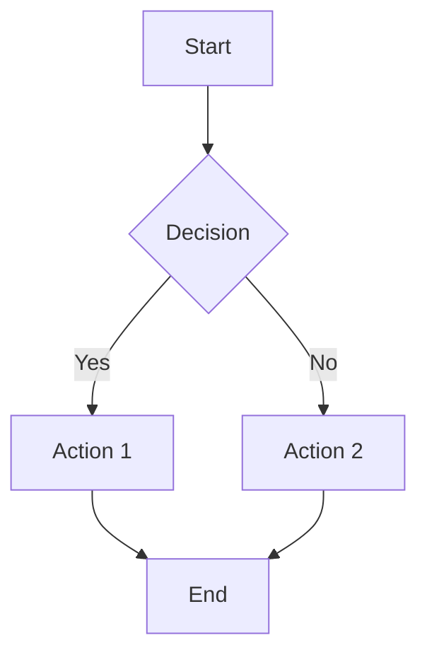

# Obsidian Flavored Markdown — Full Syntax Reference

Obsidian Flavored Markdown is a superset that combines CommonMark, GitHub Flavored Markdown (GFM), LaTeX math, and Obsidian-specific extensions.

## Table of Contents

1. [Basic Formatting](#basic-formatting)
2. [Headings](#headings)
3. [Lists](#lists)
4. [Links and Embeds](#links-and-embeds)
5. [Tags](#tags)
6. [Properties (YAML Frontmatter)](#properties-yaml-frontmatter)
7. [Callouts](#callouts)
8. [Code](#code)
9. [Tables](#tables)
10. [Math](#math)
11. [Diagrams](#diagrams)
12. [Footnotes](#footnotes)
13. [Comments](#comments)
14. [Block IDs](#block-ids)
15. [Task Lists](#task-lists)
16. [HTML](#html)

---

## Basic Formatting

| Syntax | Result |
|--------|--------|
| `**bold**` or `__bold__` | **bold** |
| `*italic*` or `_italic_` | *italic* |
| `***bold italic***` | ***bold italic*** |
| `~~strikethrough~~` | ~~strikethrough~~ |
| `==highlight==` | highlighted text (Obsidian-specific) |
| `` `inline code` `` | `inline code` |
| `> blockquote` | blockquote |
| `---` or `***` or `___` | horizontal rule |

Line breaks: End a line with two spaces or `\` for a line break within the same paragraph. A blank line creates a new paragraph.

## Headings

```markdown
# Heading 1
## Heading 2
### Heading 3
#### Heading 4
##### Heading 5
###### Heading 6
```

Headings are linkable targets: `[[Note#Heading 2]]` links directly to that section.

## Lists

### Unordered

```markdown
- Item one
- Item two
  - Nested item (2-space indent)
    - Deeper nesting
```

### Ordered

```markdown
1. First item
2. Second item
   1. Nested ordered (3-space indent to align)
```

### Mixed

```markdown
1. Ordered item
   - Unordered child
   - Another child
2. Next ordered item
```

## Links and Embeds

### Internal Links (Wikilinks)

```markdown
[[Note Name]]                    # Link to a note
[[Note Name|Display Text]]      # Link with custom display text (alias)
[[Note Name#Heading]]            # Link to a specific heading
[[Note Name#Heading|Alias]]      # Heading link with alias
[[Note Name#^block-id]]          # Link to a specific block
[[#Heading in same note]]        # Link to heading in current note
[[#^block-id]]                   # Link to block in current note
```

### Embeds (Transclusion)

Prefix a wikilink with `!` to embed the content inline:

```markdown
![[Note Name]]                   # Embed entire note
![[Note Name#Heading]]           # Embed a specific section
![[Note Name#^block-id]]         # Embed a specific block
![[image.png]]                   # Embed an image
![[image.png|300]]               # Embed image with width (pixels)
![[image.png|300x200]]           # Embed image with width x height
![[document.pdf]]                # Embed PDF
![[document.pdf#page=3]]         # Embed PDF at specific page
![[audio.mp3]]                   # Embed audio player
![[video.mp4]]                   # Embed video player
```

### External Links

```markdown
[Display Text](https://example.com)
[Display Text](https://example.com "Tooltip")
<https://example.com>                            # Auto-linked URL
```

Use standard markdown links for external URLs, wikilinks for internal.

### Image Links

```markdown


```

## Tags

Tags categorize notes and are searchable. Two places to use them:

### Inline Tags

```markdown
This note is about #project management and #meeting/weekly reviews.
```

- Must start with a letter or underscore after `#`
- Can contain letters, numbers, hyphens, underscores, forward slashes
- Nested tags: `#parent/child/grandchild` — searching `#parent` also finds `#parent/child`
- Cannot contain spaces — use hyphens: `#my-tag` not `#my tag`

### Frontmatter Tags

```yaml
---
tags:
  - project
  - meeting/weekly
---
```

Tags in frontmatter don't need the `#` prefix. Both forms are equivalent and searchable.

## Properties (YAML Frontmatter)

Properties are structured metadata at the top of a note, fenced by `---`:

```yaml
---
title: Project Alpha
date: 2026-03-16
tags:
  - project
  - active
aliases:
  - Alpha
  - Project A
cssclasses:
  - wide-page
  - kanban
status: in-progress
priority: 1
reviewed: false
due: 2026-04-01T10:00:00
related:
  - "[[Project Beta]]"
  - "[[Meeting 2026-03-10]]"
---
```

### Property Types

| Type | Example |
|------|---------|
| Text | `status: draft` |
| Number | `priority: 1` |
| Checkbox | `reviewed: false` |
| Date | `date: 2026-03-16` |
| Date & Time | `due: 2026-04-01T10:00:00` |
| List | `tags:\n  - one\n  - two` |
| Links | `related:\n  - "[[Note]]"` |

### Special Properties

- **tags** — Categorizes the note. Searchable via tag search.
- **aliases** — Alternative names for the note. Typing any alias in `[[` autocompletes to this note.
- **cssclasses** — CSS classes applied to the note in reading/editing view for custom styling.

### Rules

- Frontmatter must be the very first thing in the file (no blank lines before `---`)
- Use lowercase keys for consistency
- Quote wikilinks in YAML: `"[[Note Name]]"` (unquoted brackets break YAML parsing)
- Boolean values: `true`/`false` (not `yes`/`no` — YAML accepts both, but Obsidian normalizes to true/false)
- Dates must be in ISO format: `YYYY-MM-DD` or `YYYY-MM-DDTHH:MM:SS`

## Callouts

Callouts are styled blockquotes with semantic meaning:

```markdown
> [!note]
> Default callout with blue note icon.

> [!warning] Custom Title
> Warning with a custom title.

> [!tip]+ Expandable (open by default)
> This callout is foldable, shown expanded.

> [!faq]- Collapsed by default
> This callout is foldable, shown collapsed.
```

### Built-in Callout Types

| Type | Aliases | Color | Use for |
|------|---------|-------|---------|
| `note` | — | Blue | General information |
| `abstract` | `summary`, `tldr` | Teal | Summaries, overviews |
| `info` | — | Blue | Informational |
| `todo` | — | Blue | Action items |
| `tip` | `hint`, `important` | Cyan | Helpful suggestions |
| `success` | `check`, `done` | Green | Completed items, confirmations |
| `question` | `help`, `faq` | Yellow | Questions, FAQs |
| `warning` | `caution`, `attention` | Orange | Warnings, caveats |
| `failure` | `fail`, `missing` | Red | Failures, missing items |
| `danger` | `error` | Red | Critical warnings |
| `bug` | — | Red | Known bugs, issues |
| `example` | — | Purple | Examples, demonstrations |
| `quote` | `cite` | Gray | Quotations, citations |

### Nested Callouts

```markdown
> [!question] Can callouts be nested?
> > [!success] Yes!
> > They can.
```

## Code

### Inline Code

```markdown
Use `console.log()` to debug.
```

### Fenced Code Blocks

````markdown
```javascript
function greet(name) {
  return `Hello, ${name}!`;
}
```
````

Obsidian supports syntax highlighting for most common languages. Use the language identifier after the opening backticks.

## Tables

```markdown
| Left | Center | Right |
|:-----|:------:|------:|
| L    |   C    |     R |
| data | data   |  data |
```

- `|:---|` left-aligned
- `|:---:|` center-aligned
- `|---:|` right-aligned
- Escape pipes in cell content with `\|`

## Math (LaTeX)

### Inline Math

```markdown
The formula $E = mc^2$ describes energy-mass equivalence.
```

### Block Math

```markdown
$$
\int_0^\infty e^{-x^2} dx = \frac{\sqrt{\pi}}{2}
$$
```

Obsidian uses MathJax for rendering. Standard LaTeX math commands are supported.

## Diagrams (Mermaid)

````markdown

````

Supported diagram types: flowchart, sequence, class, state, entity-relationship, Gantt, pie, mindmap, timeline, and more. See [Mermaid docs](https://mermaid.js.org/) for full syntax.

## Footnotes

```markdown
This is a statement with a footnote.[^1]

Another claim needing a source.[^note]

[^1]: This is the footnote content.
[^note]: Footnotes can use descriptive names, not just numbers.
    Indented lines are part of the same footnote.
```

Footnote definitions can be placed anywhere in the file — Obsidian renders them at the bottom.

## Comments

```markdown
This is visible text. %%This is a hidden comment%% More visible text.

%%
Multi-line comments
are also supported.
Everything between the %% markers is hidden in reading view.
%%
```

Comments are invisible in reading/preview mode but visible in editing mode. Useful for notes-to-self or draft sections.

## Block IDs

Block IDs let you link to specific paragraphs, list items, or other blocks:

```markdown
This is an important paragraph. ^important-note

- List item one
- Key item ^key-item
```

Reference them with:
```markdown
See [[Note Name#^important-note]] for details.
See also [[#^key-item]].
```

Rules:
- Place `^id` at the end of the block, separated by a space
- IDs can contain letters, numbers, and hyphens
- IDs must be unique within a note
- Don't add block IDs preemptively — only when you need to reference a specific block

## Task Lists

```markdown
- [ ] Unchecked task
- [x] Completed task
- [ ] Task with a [[wikilink]] and #tag
- [ ] Task with a due date 📅 2026-04-01
```

Tasks are searchable via `obsidian tasks` CLI command. Common task plugins (Tasks, Dataview) extend the syntax with dates and priorities, but the base syntax is `- [ ]` and `- [x]`.

## HTML

Obsidian supports inline HTML for cases where markdown isn't sufficient:

```markdown
<details>
<summary>Click to expand</summary>

Hidden content here. Note the blank line after `<summary>`.

</details>

Text in <mark>HTML highlight</mark> or with <sub>subscript</sub> and <sup>superscript</sup>.
```

Use HTML sparingly — prefer native markdown/Obsidian syntax when available.
