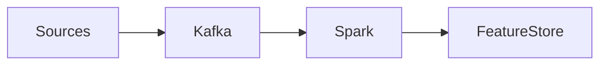

# Data Ingestion Design

Design doc for the data ingestion pipeline. #data #ingestion #architecture

## Overview

Kafka-based ingestion with Spark streaming processors.

> [!question]
> Should we support batch backfill alongside streaming?

## See Also

- [[ML-PIPELINE]]
