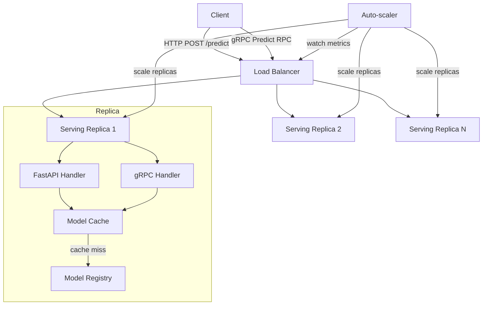

# Model Serving Architecture

Architecture note for the ML pipeline's model serving layer. #ml #serving #architecture

## Overview

The model serving layer exposes trained models from the [[ML-PIPELINE|ML Pipeline]] as a prediction service over REST and gRPC. It uses a FastAPI application that loads models on demand from the model registry and auto-scales horizontally based on incoming request volume.

## Components

- **FastAPI Service** — HTTP/REST prediction endpoint, health check, and metadata routes
- **gRPC Server** — High-throughput binary prediction interface running alongside the FastAPI process
- **Model Registry Client** — Loads and caches model artifacts; polls for new versions
- **Auto-scaler** — Monitors request queue depth and replica utilization; scales replica count up/down

## Request Flow



### Step-by-step

1. Client sends a prediction request over REST (`POST /predict`) or gRPC (`Predict` RPC).
2. The load balancer routes the request to an available serving replica.
3. Inside the replica, the FastAPI handler or gRPC handler deserializes the payload and invokes the model cache.
4. If the requested model version is already in the in-process cache, inference runs immediately. On a cache miss, the model registry client fetches the artifact and populates the cache.
5. The handler runs inference, serializes the result, and returns the response.
6. The auto-scaler continuously reads replica CPU/memory utilization and queue depth from the load balancer. When sustained load exceeds the scale-up threshold, new replicas are provisioned. When load drops below the scale-down threshold for a cooldown window, excess replicas are terminated.

## Scaling Policy

| Metric | Scale-up threshold | Scale-down threshold | Cooldown |
|---|---|---|---|
| Request queue depth | > 50 pending | < 5 pending | 3 min |
| Replica CPU utilization | > 70% | < 30% | 5 min |

Minimum replicas: 2. Maximum replicas: configurable per deployment.

## Interfaces

### REST

```
POST /predict
Content-Type: application/json

{
  "model_name": "fraud-detector",
  "model_version": "2.1.0",
  "inputs": { ... }
}
```

### gRPC

Service definition lives in `proto/serving/v1/predict.proto`. The `Predict` unary RPC and `PredictStream` server-streaming RPC are both supported.

## Related Notes

- [[ML-PIPELINE]] — top-level pipeline index
- [[DATA-INGESTION-DESIGN]] — upstream data ingestion design
