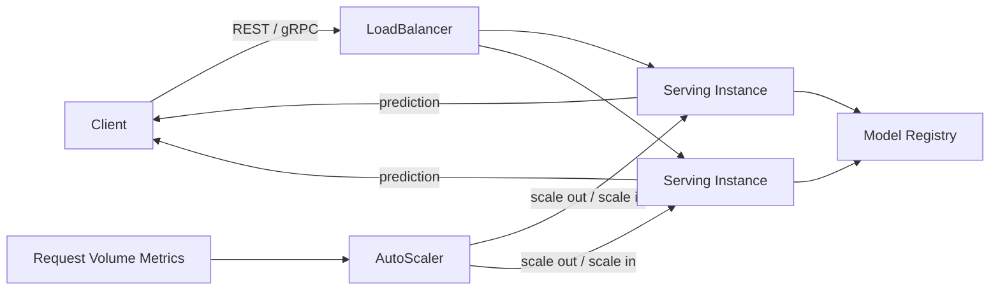

# Model Serving Layer Architecture

Architecture note for the new model serving layer in the ML pipeline. #ml #serving #architecture

## Overview

The model serving layer is a FastAPI service that loads trained models from the model registry and exposes predictions over both REST and gRPC interfaces. It auto-scales horizontally based on incoming request volume.

## Request Flow

## Components

### FastAPI Service

- Loads model artifacts from the model registry at startup and on-demand when a new model version is promoted
- Exposes `/predict` (REST) and a gRPC endpoint for prediction requests
- Emits per-request latency and throughput metrics consumed by the auto-scaler

### Model Registry Integration

- Service pulls model binaries and metadata (version, schema, runtime dependencies) from the registry
- Supports hot-swapping model versions without downtime via version-pinned load

### Transport Layer

| Interface | Protocol | Use Case |
|---|---|---|
| REST | HTTP/JSON | External clients, dashboards |
| gRPC | HTTP/2 + Protobuf | Internal ML services, low-latency inference |

### Auto-Scaling

- Horizontal pod autoscaling driven by request-per-second (RPS) metrics
- Scale-out threshold and scale-in cooldown are configurable per deployment

> [!question]
> Should the gRPC and REST interfaces be separate services, or remain co-located in the same FastAPI instance?

> [!danger]
> Model hot-swap during high-traffic periods may cause a brief latency spike — validate under load before enabling in production.

## See Also

- [[ML-PIPELINE]]
- [[DATA-INGESTION-DESIGN]]
